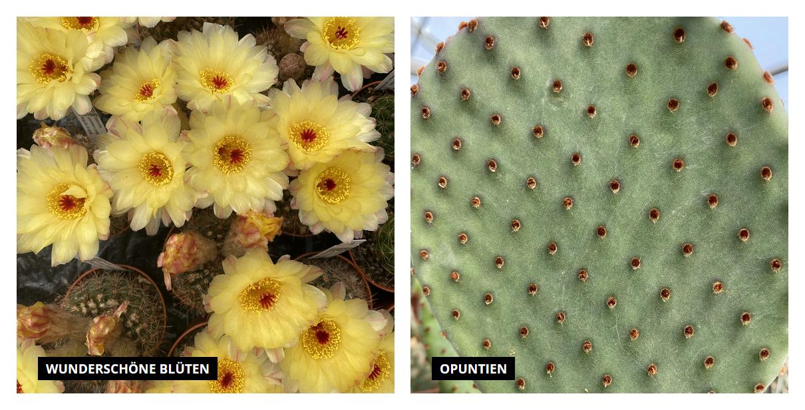

# Shopware5-MyfavImageBox
Image-Box for the shopping-worlds of shopware 5. Shows two images with a text overlay, side by side, in the shopping worlds. Design is compatible to the [specialBox Plugin](https://github.com/sfxon/Shopware5-MyfavSpecialBox).

And this is what it looks like:



## Installation

1. Extract files to a folder ```custom/plugins/MyfavImageBox```

2. Open plugin manager in shopware 5 backend.

3. Install plugin in the plugin manager.

4. Use in a shopping world.
